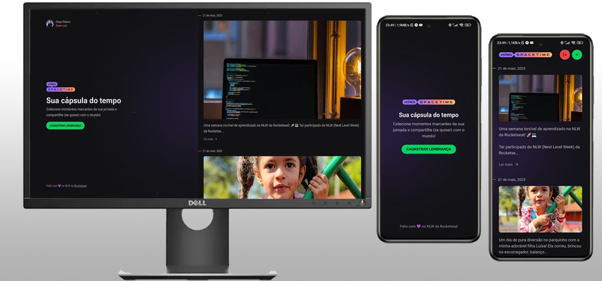

<h1 align="center">
    
</h1>

  <a href="#-technologies">Technologies</a>&nbsp;&nbsp;&nbsp;|&nbsp;&nbsp;&nbsp;
  <a href="#-project">Project</a>&nbsp;&nbsp;&nbsp;|&nbsp;&nbsp;&nbsp;
  <a href="#-implements">Implements</a>&nbsp;&nbsp;&nbsp;

  

## 🚀 Technology

This project was developed with the following technologies:

- [NEXT.js](https://nextjs.org/)
- [Node.js](https://nodejs.org/en/)
- [React](https://reactjs.org)
- [React Native](https://facebook.github.io/react-native/)
- [Expo](https://expo.io/)
- [TypeScript](https://www.typescriptlang.org/)

## 💻 Project

A Next.js, React, and React Native project that serves as a digital "time capsule" for storing memories. It allows users to record significant moments, such as photos and messages, at different stages of life. Memories are organized chronologically and can be accessed both in a mobile application and on a website.

---

## 🔖 Implements

SERVER
* npm install
* add the environment variables in env.example
* run npx prisma migrate dev --preview-feature, to create the sqlite database 
* npm run dev 

WEB
* npm install
* add the environment variables in env.local.example
* change ip in src/lib.api.ts and next.config.js to local or production ip
* npm run dev 

MOBILE
* npm install
* change ip in src/lib.api.ts to local or production ip
* npm run start
##### Remember that when switching from web to mobile, change the environment variable on the server and restart the server

 
<h4>
    Done with 💛 by <a href="https://www.linkedin.com/in/diego-ribeiro-10a14477/" target="_blank">Diego Ribeiro</a>
</h4>
